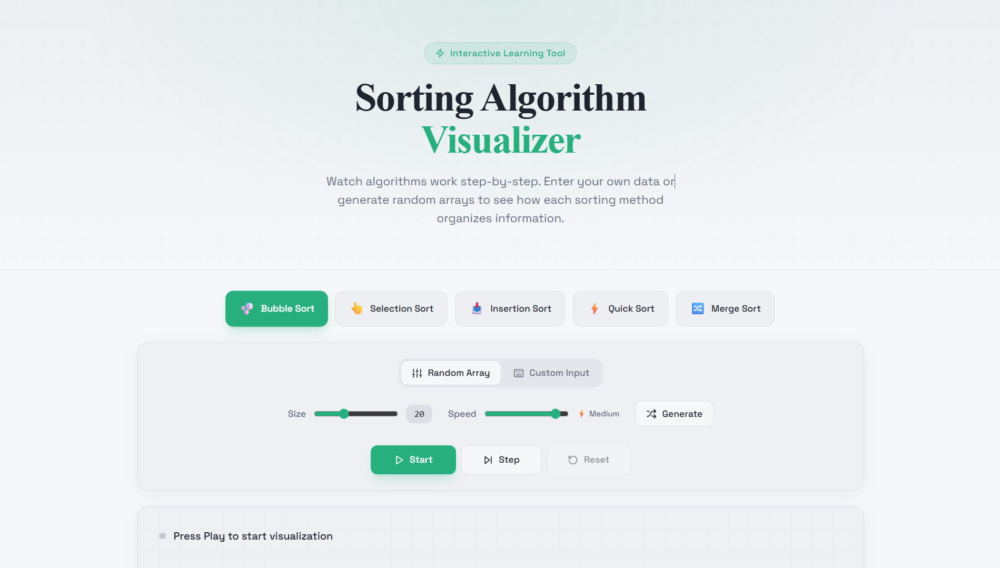
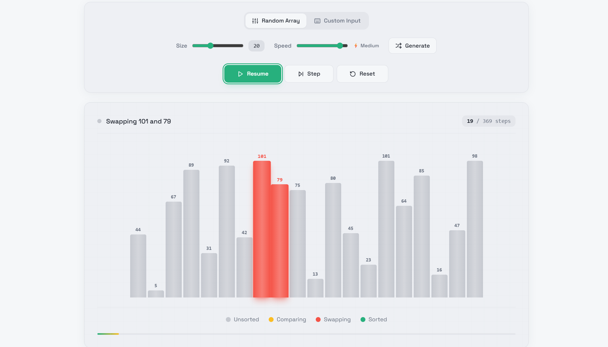

# Sorting Visualizer

> **Visualize, learn, and master sorting algorithms.**
> A public learning tool built with React, TypeScript, Vite, Tailwind CSS, and shadcn/ui.

[](https://vercel.com/new)
[](LICENSE)

---

## 🚀 Features

- **Live Algorithm Animations**: Bubble, Selection, Insertion, Quick, and Merge sort rendered step-by-step with highlights for comparisons, swaps, and sorted values.
- **Speed Control**: Adjust the interval between frames to slow down or speed up the visualization.
- **Custom & Random Arrays**: Generate random data or paste your own numbers to explore different cases.
- **Algorithm Insights**: Each algorithm includes time/space complexity plus a short description.
- **Dark/Light Theme Toggle**: Switch themes for comfortable viewing in any environment.
- **Responsive & Accessible**: Works on desktop and mobile with accessible focus states and readable typography.

---

## 🖼️ Preview

| Intro screen | Sorting visualization |
| --- | --- |
|  |  |

> Live preview: https://sortingalgorithmvisualizer.vercel.app

---

## 🛠️ Local Development

1. Clone the repo and install dependencies:
   ```sh
   git clone https://github.com/abhi9vaidya/SortingAlgorithmVisualizer.git
   cd SortingAlgorithmVisualizer
   npm install
   ```
2. Run the dev server:
   ```sh
   npm run dev
   ```
3. Open [http://localhost:8080](http://localhost:8080) to interact with the app.

---

## ☁️ Deploying to Vercel

1. Sign in at [vercel.com](https://vercel.com/).
2. Click **New Project** and import this repository.
3. Vercel auto-detects Vite; keep the defaults (`npm run build`, output `dist`).
4. Deploy and copy the generated public URL.
5. Push to `main` to trigger automatic redeploys whenever you update the code.

---

## 🌐 Live Demo

[https://sortingalgorithmvisualizer.vercel.app](https://sortingalgorithmvisualizer.vercel.app)

---

## 🧩 Project Structure

- `src/components/` – UI components, visualizer canvas, controls, and detail panels
- `src/core/` – Sorting engines, steps, and related types
- `src/pages/` – Route-level pages (currently `Index.tsx`)
- `src/lib/` – Shared utilities like `cn`

---

## 📚 Supported Algorithms

| Algorithm      | Average Time | Space | Description                          |
|---------------|--------------|-------|--------------------------------------|
| Bubble Sort   | O(n²)        | O(1)  | Comparison-based swaps along the array |
| Selection Sort| O(n²)        | O(1)  | Selects the smallest element per pass |
| Insertion Sort| O(n²)        | O(1)  | Builds a sorted section in place      |
| Quick Sort    | O(n log n)   | O(log n)| Pivot-based divide-and-conquer      |
| Merge Sort    | O(n log n)   | O(n)  | Recursive merging of sorted halves   |

Each algorithm visualization shows which indices are comparing, swapping, and already sorted.

---

## 🎨 Technology Stack

- [React](https://react.dev/) – Declarative UI and hooks
- [TypeScript](https://www.typescriptlang.org/) – Static typing
- [Vite](https://vitejs.dev/) – Dev server and build tool
- [Tailwind CSS](https://tailwindcss.com/) – Utility-first styling
- [shadcn/ui](https://ui.shadcn.com/) – Accessible component primitives
- [Sonner](https://sonner.dev/) – Toast notifications
- [Lucide](https://lucide.dev/) – Iconography

---

## 🤝 Contributing

This project is MIT-licensed and welcomes contributions:

1. Fork the repo.
2. Create a branch (`git checkout -b feature/your-idea`).
3. Commit your changes with clear messaging.
4. Push to your fork and open a pull request.

Please keep accessibility and educational clarity as priorities.

---

## 📄 License

MIT. See the `LICENSE` file for details.

---

**Created by Abhin Vaidya**


